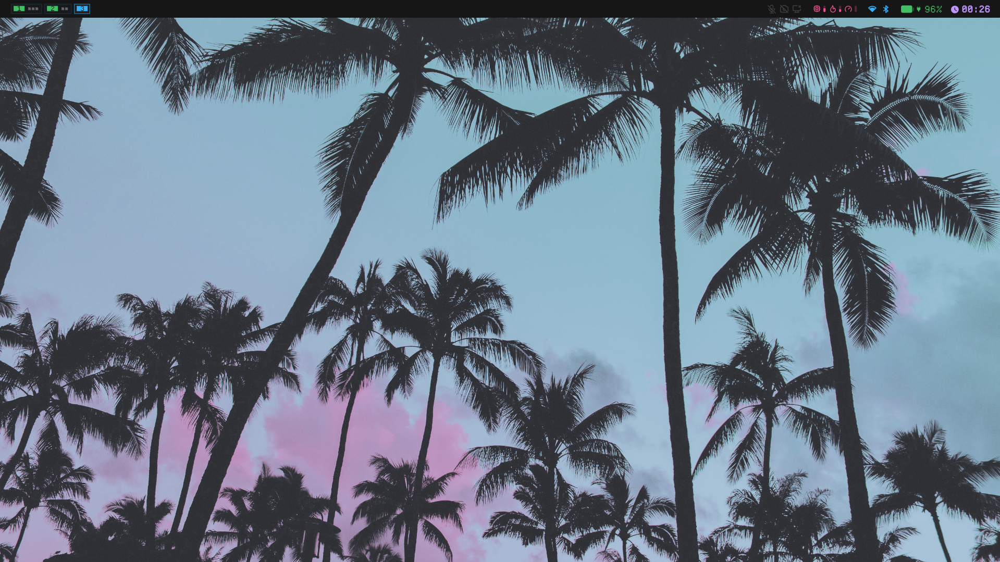
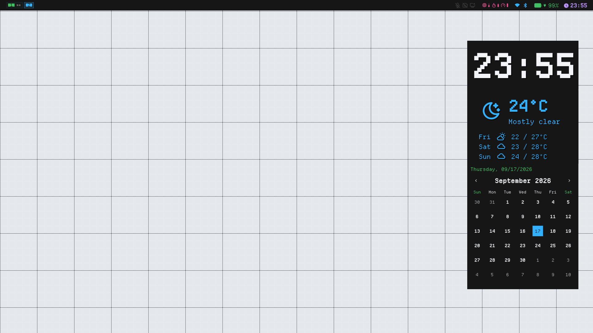

# Niri + Noctalia v5 Dotfiles

A scrollable-tiling [Niri](https://niri.wm/) setup paired with the [Noctalia v5](https://noctalia.dev/) desktop shell (bar, panels, launcher, control center, notifications, wallpaper, lock screen, desktop widgets).

<p align="center">
  
  
</p>

---

## Requirements

### Core

| Package | Purpose |
|---|---|
| `niri` (recent git / 26.04+) | Wayland compositor. Needs a recent build for `background-effect` blur support and `custom-shader` animations. |
| `noctalia` (v5) | The desktop shell. Provides bar, launcher, panels, dock, control center, notifications, wallpaper, lock screen and session actions. |
| `niri-float-sticky` | [Daemon](https://github.com/probeldev/niri-float-sticky) that makes floating windows "sticky" across workspaces (niri doesn't do this natively). Exposes `-ipc toggle_sticky` for the `Mod+Shift+G` bind. |

### Clipboard

| Package | Purpose |
|---|---|
| `wl-clipboard` (`wl-copy`/`wl-paste`) | Wayland clipboard, used by the cliphist watchers. |
| `cliphist` | Clipboard history store; the watchers pipe `wl-paste` into it in the background at startup. |
| `wl-clip-persist` | Keeps clipboard content alive after an app exits. |

### System / media

| Package | Purpose |
|---|---|
| `libnotify` (`notify-send`) | Notifications (lid open/close events, recording toasts). |
| `wf-recorder` | Fallback recording engine (`Mod+Print`). |
| `playerctl` | Media playback control (Play/Stop/Prev/Next binds). |
| `wireplumber` (`wpctl`) | Default audio sink mute toggle (`Mod+Shift+M`). |
| `gsettings` + `adw-gtk3-dark` | GTK theme applied at startup. |
| `Colloid-Dark` icon theme + `Qogirr` cursor theme | Desktop icon/cursor theming. |
| `evtest` | Required by the Show Keys plugin (`/dev/input/event*` access). |

### Referenced apps

| App | Used for |
|---|---|
| `kitty` | Default terminal (`Mod+Return`). |
| `nautilus` | File manager (`Super+E`). |
| `zen-browser` | Browser (`Super+B`). |
| `zed` | Zed projects provider in the launcher (`/zed`, `Mod+Z`). |
| `gh` | GitHub Kanban plugin (authenticated via `gh auth login`). |

> **Outdated:** Noctalia v4 (Quickshell, `qs -c noctalia-shell …`) is no longer used. All binds are pure Noctalia v5 (`noctalia msg …`) — the v4 fallback shims were removed from `config.d/binds.kdl`.

---

## File structure

```
~/.config/niri/
├── config.kdl                      # Main entry point
├── noctalia.kdl                    # Carbon-blue accent theme for layout focus/border
├── noctalia-full-config.toml       # Full Noctalia v5 config (plugins, bar, widgets, theme, shell)
├── config.d/
│   ├── input-and-cursor.kdl        # Keyboard, touchpad, mouse, trackpoint, gestures, cursor theme
│   ├── layout-and-overview.kdl     # Gaps, columns, shadows, overview, lid switch events
│   ├── window-rules.kdl            # Per-app window rules (Noctalia, foot/kitty, keyboards, PiP…)
│   ├── environment.kdl             # Wayland env vars (GDK/QT/SDL/XDG…)
│   ├── startup.kdl                 # Autostarted daemons, clipboard, GTK theme
│   ├── animations.kdl              # Springs + custom GLSL open/close sweep shaders
│   ├── binds.kdl                   # All keybindings
│   ├── layer-rules.kdl             # Noctalia/waybar layer surface blur & shadow rules
│   ├── liquid-glass.kdl            # (disabled) iOS-style liquid-glass effect rules
│   └── user-extra.kdl              # Scratch space for personal overrides
└── Screenshots/                    # Preview images
```

`config.kdl` includes everything from `config.d/` plus `noctalia.kdl`. `liquid-glass.kdl` is optionally included (`//include optional=true`) and is currently disabled.

### What each file does

- **config.kdl** — `prefer-no-csd`, hotkey overlay (skipped at startup), screenshot path (`~/Pictures/Screenshots/…`), includes, and the `eDP-1` output at scale 1.
- **noctalia.kdl** — accent theme: `#33b1ff` active / `#161616` inactive / `#ee5396` urgent for focus-ring, border, tab-indicator, insert-hint, and recent-windows highlight.
- **input-and-cursor.kdl** — US+Arabic (`us,ara`) xkb layout on `pc105` with `grp:alt_shift_toggle`, per-window layout tracking, touchpad tap + natural scroll, `Super` mod key, `Qogirr` cursor at 32px, hot corners off.
- **layout-and-overview.kdl** — zero gaps, transparent background, preset column widths (1/3, 1/2, 2/3), soft window shadow, workspace overview zoom, and lid-close/open notifications.
- **window-rules.kdl** — default border/shadow/opacity for all windows; Noctalia settings window floats at 1080×920; foot/kitty/Alacritty open at half width; PiP windows float bottom-right at 560×315; the on-screen `Keyboard` gets blur + rounded corners; `pavucontrol` and `nm-connection-editor` float.
- **environment.kdl** — forces Wayland backends (`GDK_BACKEND`, `QT_QPA_PLATFORM=wayland;xcb`, `SDL_VIDEODRIVER`, `CLUTTER_BACKEND`), `XDG_CURRENT_DESKTOP=niri`, `qt6ct` platform theme, no CSD on Qt, Mozilla Wayland, Electron ozone auto.
- **startup.kdl** — autostarts `noctalia`, `niri-float-sticky`, cliphist watchers (`wl-paste --watch cliphist store`), `wl-clip-persist`, then applies GTK/icon themes.
- **animations.kdl** — animations `off` globally with `slowdown 0.25`, runtime springs for workspace/window movement, and two 1400 ms GLSL shaders: a corner-to-corner sweep reveal on `window-open`, and a bob-then-slide-down on `window-close`.
- **binds.kdl** — full Noctalia v5 keybinding set (below). Everything is `noctalia msg …` IPC.
- **layer-rules.kdl** — disables blur/xray on dock + desktop widgets, adds shadows to `waybar` and `noctalia-bar-default`, blurs behind the window switcher, and places wallpaper layers within the backdrop.

### `liquid-glass.kdl` (disabled)

A saved "iOS glass" style setup: frosted blur + custom `liquid-glass` refraction/edge-lighting parameters for windows and Noctalia panels. Not currently included — re-enable with `include optional=true "config.d/liquid-glass.kdl"`.

---

## Noctalia plugins in use

> **Outdated:** The plugins under `~/.config/noctalia/plugins/` (below) are **v4 legacy plugins** (Quickshell/QML-based). They are not v5 plugins. The actual v5 plugins are enabled in `~/.config/noctalia/config.toml` — see the next section.

### v4 legacy plugins (leftover from Noctalia v4, installed in `~/.config/noctalia/plugins/`)

| Plugin | Version | What it adds | Extra requirements |
|---|---|---|---|
| `kde-connect` | 1.2.1 | Mobile device integration (Phone Display, sync, file browsing) from bar/control center | `kdeconnectd` running; `sshfs` + `libfuse` for file browsing |
| `keep-awake-plus` | 0.3.0 | Session keep-awake with partial/full inhibit modes + persistent last choice | — |
| `keybind-cheatsheet` | 3.7.3 | Searchable keybind viewer that auto-detects Niri (see also `blackbartblues/keymap` below) | — |
| `notes-scratchpad` | 1.1.6 | Quick scratchpad for throwaway notes | — |
| `pomodoro` | 1.2.0 | Pomodoro timer (bar widget + panel + alarm sound) | — |
| `screen-toolkit` | 1.3.3 | Color picker, annotate, record, pin, OCR, QR scan, palette, measure, webcam mirror | `grim`, `slurp`, `hyprpicker`, `tesseract`, `ffmpeg`, `wl-screenrec`/`wf-recorder`, `translate-shell`, `imagemagick`, `zbar`, `curl`, `jq` |
| `show-keys` | 1.0.2 | Real-time keypress OSD via `evtest` | `evtest` + read access to `/dev/input/event*` |
| `tamagotchi` | 1.1.2 | Desktop Tamagotchi pet living on the taskbar | — |

### Noctalia v5 plugins (the actual ones — `~/.config/noctalia/config.toml` → `[plugins].enabled`)

The v5 plugins are enabled declaratively in Noctalia's own config (a full copy is stored here as `noctalia-full-config.toml`). They come from three git sources:

| Source | Location |
|---|---|
| `official` | https://github.com/noctalia-dev/official-plugins |
| `community` | https://github.com/noctalia-dev/community-plugins |
| `Custom_Plugins` | https://github.com/olafkfreund/nocatalia-v5-plugins/tree/main |

| Plugin ID | What it does | Bind / widget | Extra requirements |
|---|---|---|---|
| `noctalia/bongocat` | Bongo Cat bar widget that slaps to your typing/music | bar widgets `bongocat`, `cat`, `cat_2` | audio input + `/dev/input` access (uses `event3`) |
| `noctalia/translator` | Translate text straight from the launcher (`/tr`) | — | network |
| `noctalia/timer` | Countdown timer (bar widget, panel, desktop widget) | — | — |
| `noctalia/kaomoji` | Browse/copy kaomoji emoticons from the launcher | — | — |
| `nightwatch75/todo` | Prioritized to-do list panel | `Mod+grave` | — |
| `dotnetrob/cat` | RunCat-style cat; speed tracks CPU usage | — | — |
| `cleboost/zed-provider` | Recent Zed projects in the launcher (`/zed`) | `Mod+Z` | `zed` |
| `icefish/phone-connect` | Control phones via KDE Connect (battery, ring, ping, share, clipboard, pairing) | commented `Mod+P` bind | KDE Connect daemon |
| `alexander/screen-toolkit` | Screen tools: color picker, OCR, annotate, record, pin, measure, webcam mirror | `Mod+F2`, control-center shortcut | `grim`, `slurp`, `hyprpicker`, `tesseract`, `ffmpeg`, `wl-screenrec`/`wf-recorder`, `translate-shell`, `imagemagick`, `zbar`, `curl`, `jq` |
| `blackbartblues/keymap` | Searchable keymap cheatsheet/editor (parses niri binds) | `Mod+Shift+Slash` | `niri` CLI on `PATH` |
| `yuuto/arch-updater` | Check pacman/AUR/Flatpak updates, upgrade in terminal or background | — | Arch Linux (`yay`/`paru`, `flatpak`) |
| `weinguyen/opencode-companion` | OpenCode AI agent chat panel, session management, MCP status | — | `opencode` |
| `yuuto/calculator` | Calculator panel | `Mod+Alt+C` | — |
| `kenn/keybind-cheatsheet` | Searchable keybind cheatsheet panel | — | `niri` CLI on `PATH` |
| `h-jangra/keyviz` | Floating translucent keystroke HUD | — | evdev / `/dev/input` access |
| `cleboost/hotspot` | Start/stop a Wi-Fi hotspot, view connected devices | — | `nmcli`, `iw`, `ip` |
| `autumn/network-toolkit` | Unified network control panel (Wi-Fi, Bluetooth, Ethernet, hotspot, DNS) | bar widget `widget` | — |
| `0lucasmatheus/awwwall` | Animated (GIF) wallpapers via awww | — | awww / Animated Wallpapers |
| `noctalia/screen_recorder` | Hardware-accelerated recording + replay buffer | `Mod+F3`, `recorder` bar widgets | `gpu-screen-recorder` |
| `liamwh/emoji-picker` | Raycast-inspired emoji & symbol picker | `Mod+Slash` (launcher `/emo`) | — |
| `shangshui0302/github-kanban` | GitHub dashboard (PRs, issues, notifications, contributions heatmap) | `Mod+G` | `gh` authenticated via `gh auth login`, `xdg-open` |
| `ashur-d/wallpaper-widget` | Cinematic wallpaper carousel/switcher | `Mod+Shift+W` | optional `magick`/`convert`/`ffmpeg` for cached thumbnails |
| `imjustdoingmypart/niri-animations` | Pick niri animation presets from a panel | — | `niri` CLI + a dedicated animation include file |
| `ramosdetrigo/godot-provider` | Recent Godot projects in the launcher (`/gd`) | — | Godot |
| `aabidk20/yt-music` | YouTube Music client (full panel + miniplayer) | `Mod+M` | `yt-dlp`, `mpv`, `mpv-mpris`, `jq`, `curl`, `nc` |
| `fel/agent-glow` | AI agent activity "glow" status with notifications | — | — |
| `thaerob99/default-apps` | Default-apps manager | — | — |

### Built-in Noctalia features driven by the binds

- **Launcher views** — `Mod+Space` (main), `Mod+Tab` (windows list `/win`), `Mod+Z` (Zed `/zed` bundled with `cleboost/zed-provider`), `Mod+Slash` (emoji `/emo` via `liamwh/emoji-picker`).
- **Control center** — `Mod+S` (main), `Mod+N` (notifications), plus shortcuts (Wi-Fi, Bluetooth, caffeine, notifications, power profile, screen-toolkit).
- **Session** — `Mod+Shift+E` (session menu), `Mod+Alt+L` (lock screen), `XF86PowerOff` (session panel); idle → screen-off → lock → lock-and-suspend.
- **Media/volume/brightness OSDs** — via `noctalia msg volume-*`, `brightness-*`, etc.
- **Screenshots** — `Print` region, `Ctrl+Print` fullscreen, `Alt+Print` window (via `noctalia msg screenshot-*`).
- **Desktop widgets** — `Mod+F1` enters edit mode; `Mod+Shift+U` sets a random wallpaper; `Mod+Shift+W` switches wallpapers via the wallpaper-widget carousel.

---

## Keybindings

`Mod` = `Super`. Full listing is in `config.d/binds.kdl` (the **Keymap/cheatsheet** plugins render it; `Mod+Shift+Slash` shows it).

### Core window management
| Keys | Action |
|---|---|
| `Mod+Q` | Close window |
| `Mod+F` | Fullscreen |
| `Mod+A` | Toggle floating |
| `Mod+D` | Maximize column |
| `Mod+C` / `Mod+Ctrl+C` | Center column / center visible columns |
| `Mod+Shift+G` | Toggle sticky floating window (`niri-float-sticky -ipc toggle_sticky`) |
| `Mod+R` / `Mod+Shift+R` / `Mod+Ctrl+R` | Cycle width / cycle height / reset height |
| `Mod+Minus` / `Mod+Equal` | Column width −/+ 10% |
| `Mod+Shift+Minus` / `Mod+Shift+Equal` | Window height −/+ 10% |
| `Mod+[` / `Mod+]` | Consume/expel window left/right |

### Focus & movement (Vim-style)
| Keys | Action |
|---|---|
| `Mod+H` / `Mod+L` | Focus column left/right |
| `Mod+J` / `Mod+K` | Focus window/workspace down/up |
| `Mod+Shift+H` / `Mod+Shift+L` | Move column left/right |
| `Mod+Shift+J` / `Mod+Shift+K` | Move window down/up (or across workspaces) |
| `Mod+1…9` | Focus workspace |
| `Mod+Shift+1…9` | Move column to workspace |

### Noctalia / launcher / media
| Keys | Action |
|---|---|
| `Mod+O` | Toggle overview |
| `Mod+Space` | Launcher |
| `Mod+Tab` | Windows list |
| `Mod+S` | Control center |
| `Mod+Comma` | Settings |
| `Mod+V` | Clipboard history |
| `Mod+N` | Notifications |
| `Mod+M` | YouTube Music |
| `Mod+G` | GitHub dashboard |
| `Mod+Shift+E` | Session menu |
| `Mod+Alt+L` | Lock screen |
| `Mod+Shift+M` | Mute sink |
| `Mod+Shift+P` / `Mod+Shift+N` / `Mod+Shift+B` | Play/pause / next / previous (locked) |
| `XF86Audio*` / `XF86MonBrightness*` | Volume & brightness OSDs (locked) |
| `Mod+Print` | Record with `wf-recorder` (`~/Videos/…`) |
| `Print` / `Ctrl+Print` / `Alt+Print` | Noctalia region / fullscreen / window screenshots |

---

## Resources

- Niri: https://niri.wm/
- Noctalia v5 docs: https://docs.noctalia.dev/v5/
- Niri + Noctalia integration guide: https://docs.noctalia.dev/v5/compositor-settings/niri
- Plugins: https://noctalia.dev/plugins
- niri-float-sticky: https://github.com/probeldev/niri-float-sticky